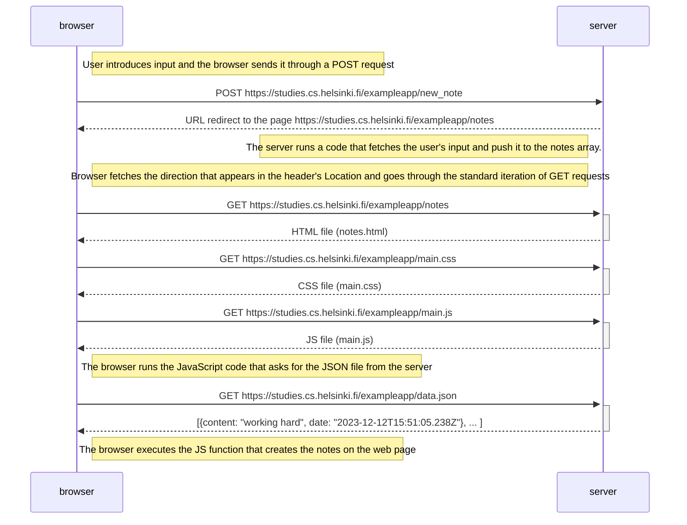

```mermaid
sequenceDiagram
    participant browser
    participant server

    Note right of browser: User introduces input and the browser sends it through a POST request 
    browser->>server: POST https://studies.cs.helsinki.fi/exampleapp/new_note
    activate server
    server-->>browser: URL redirect to the page https://studies.cs.helsinki.fi/exampleapp/notes
    Note left of server: The server runs a code that fetches the user's input and push it to the notes array.

    Note right of browser: Browser fetches the direction that appears in the header's Location and goes through the standard iteration of GET requests
                            
    browser->>server: GET https://studies.cs.helsinki.fi/exampleapp/notes
    activate server
    server-->>browser: HTML file (notes.html)
    deactivate server

    browser->>server: GET https://studies.cs.helsinki.fi/exampleapp/main.css
    activate server
    server-->>browser: CSS file (main.css)
    deactivate server

    browser->>server: GET https://studies.cs.helsinki.fi/exampleapp/main.js
    activate server
    server-->>browser: JS file (main.js)
    deactivate server

    Note right of browser: The browser runs the JavaScript code that asks for the JSON file from the server

    browser->>server: GET https://studies.cs.helsinki.fi/exampleapp/data.json
    activate server
    server-->>browser: [{content: "working hard", date: "2023-12-12T15:51:05.238Z"}, ... ]
    deactivate server

    Note right of browser: The browser executes the JS function that creates the notes on the web page
```