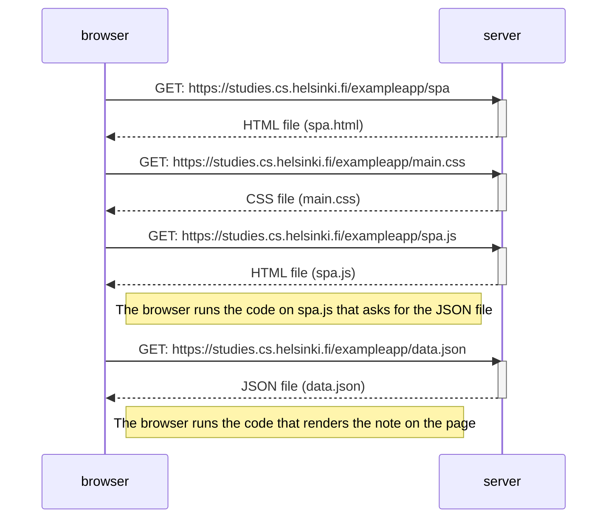

```mermaid
sequenceDiagram
    participant browser
    participant server

    browser->>server: GET: https://studies.cs.helsinki.fi/exampleapp/spa
    activate server
    server-->>browser: HTML file (spa.html)
    deactivate server

    browser->>server: GET: https://studies.cs.helsinki.fi/exampleapp/main.css
    activate server
    server-->>browser: CSS file (main.css)
    deactivate server

    browser->>server: GET: https://studies.cs.helsinki.fi/exampleapp/spa.js
    activate server
    server-->>browser: HTML file (spa.js)
    deactivate server

    Note right of browser: The browser runs the code on spa.js that asks for the JSON file
    browser->>server: GET: https://studies.cs.helsinki.fi/exampleapp/data.json
    activate server
    server-->>browser: JSON file (data.json)
    deactivate server
    Note right of browser: The browser runs the code that renders the note on the page    
```