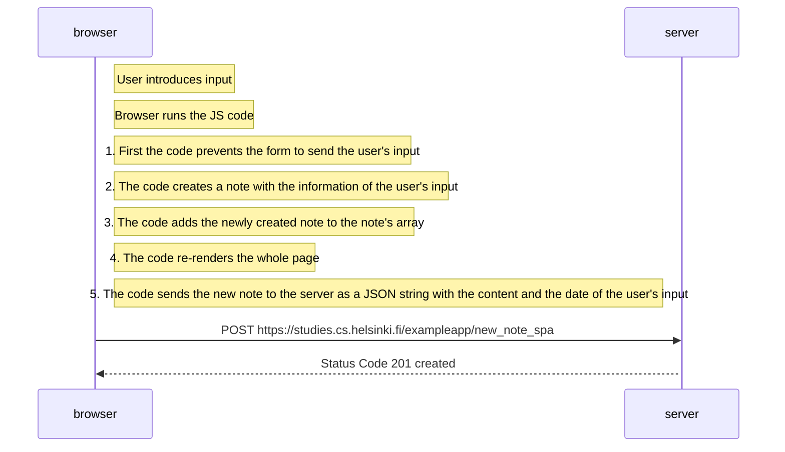

```mermaid
sequenceDiagram
    participant browser
    participant server

    Note right of browser: User introduces input
    Note right of browser: Browser runs the JS code
    Note right of browser: 1. First the code prevents the form to send the user's input
    Note right of browser: 2. The code creates a note with the information of the user's input
    Note right of browser: 3. The code adds the newly created note to the note's array
    Note right of browser: 4. The code re-renders the whole page
    Note right of browser: 5. The code sends the new note to the server as a JSON string with the content and the date of the user's input
    browser->>server: POST https://studies.cs.helsinki.fi/exampleapp/new_note_spa
    activate server
    server-->>browser: Status Code 201 created    
```